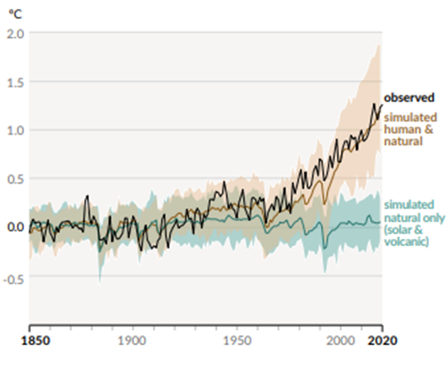
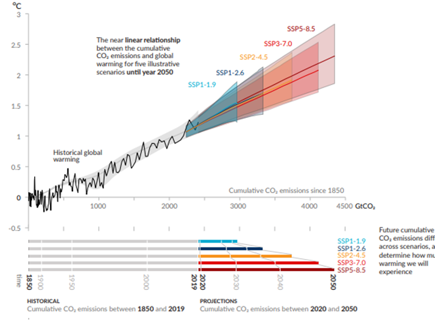
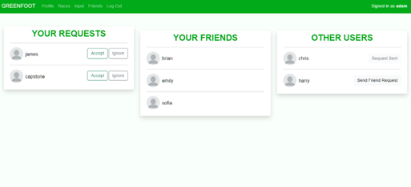
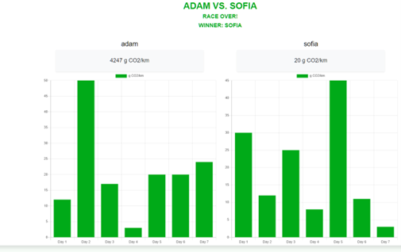
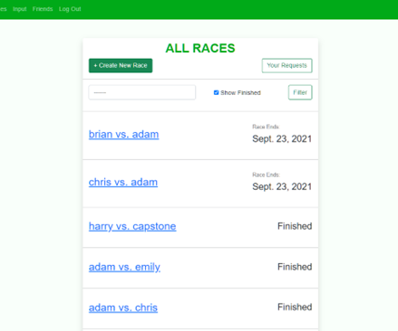
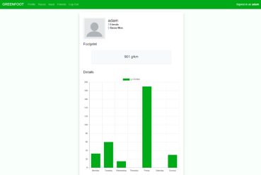

# Overiew

 On August 9th, 2021, the Intergovernmental Panel on Climate Change (IPCC) released the first part of their sixth assessment of the climate crisis. The report highlighted how human activity has increased the global average surface temperate by 1.50C since 1850. The report also highlighted potential climate scenarios that could occur; as the temperature increased with each scenario, climate extremes, such as heat waves, heavy precipitation, droughts, and tropical cyclones became increasingly frequent. The reports central conclusion to limiting future human-induced global warming requires limiting cumulative carbon dioxide emissions. This is because scientists have found a near-linear link between cumulative anthropogenic CO2 emissions and the global warming they cause.

The objective of the project is to design and build a web application that incentivizes users to track their carbon dioxide emissions to increase their self-awareness of their emissions and make lifestyle changes to limit global warming. The project, named GreenFoot, must allow users to track their carbon footprint, input how far they travelled with what method to calculate carbon dioxide emissions, and add friends to compare weekly carbon dioxide emissions. GreenFoot was built using a MySQL relational database, Django (Python) backend, and a HTML, CSS & JavaScript frontend. The code for this project can be found on my Github here.

Outside of this report, this project was submitted as a final capstone project in the University of Harvard’s CS50 Web Programming Course with Python and JavaScript. The requirements from the course were that the project be an original, complex web application that uses an SQL Database, Django (Python) back-end, JavaScript front-end, and be mobile responsive.

## Background Information

On August 9th, 2021, the Intergovernmental Panel on Climate Change (IPCC) released the first part of their sixth assessment of the climate crisis. The report was divided into four parts: the current state of the climate, possible climate futures, climate information for risk assessment per region, and limiting future climate change.

The first section, the current state of the climate, presented how human activity has affected the earth’s climate and is causing both current and future consequences. Human activity has increased average global surface temperatures by approximately 1.50C since 1850. The first section of the report also highlighted the current consequences of global warming. Globally averaged precipitation has likely increased since 1950. There are observed changes in near-surface ocean salinity, mid-latitude storms, and the global retreat of glaciers since the 1990s. Global mean sea level has increase by 0.20 m between 1901 and 2018. Climate zones have shifted poleward in both hemispheres. Weather and climate extremes, such as “heat waves, heavy precipitation, droughts, and tropical cyclones”, have become increasingly frequent. It is “extremely likely” that each of these anomalies have human activity as the main driver.

*Change in global surface temperature (annual average) as observed and simulated using human & natural and natural factors*

The second section of the report, possible climate futures, examined five potential scenarios that could occur based the potential differences in global surface temperature between 1850-1900 to 2081-2100. The five scenarios are SSP1-1.9, SSP1-2.6, SSP2-4.5, SSP3-7.0 and SSP5-8.5 and their differences are 1.0 to 1.80C, 1.3 to 2.40C, 2.1 to 3.50C, 2.8 to 4.60C, 3.3 to 5.70C, respectively. Unfortunately, despite these varying temperature differences, each scenario has global surface temperatures increase until at least the mid-century. Additionally, many climate changes from past and future greenhouse gas emissions are “irreversible for centuries to millennia, especially changes in the ocean, ice sheets and global sea level”. When examining each of the scenarios, there is a direct relation between the level of changes in a climate system and the increase in global warming. In other words, the worse the scenario, the greater the frequency and intensity of hot extremes, marine heatwaves, heavy precipitation, agricultural and ecological droughts, and more.

*Near-linear relationship between cumulative CO2 emissions and the increase in global surface temperature.*

The reports central conclusion to limiting future human-induced global warming requires limiting cumulative carbon dioxide emissions - reaching at least net zero emissions. This is because scientists have found a near-linear link between cumulative anthropogenic CO2 emissions and the global warming they cause.

# Solution: Greenfoot

## Problem Definition

The IPCC’s report describes a clear link between global warming and increasing carbon dioxide emissions, and that these emissions are coming from an increase in human activity. The transportation sector represents the largest share of greenhouse gas emissions with 29% of total emissions. This is from the burning of fossil fuels for vehicles such as cars, trucks, and planes. Therefore, it is likely that humans can lower their carbon dioxide emissions by reducing the amount they travel or altering their transportation methods. A study in New Zealand examined climate change awareness and its link with travel related decision-making found that climate change awareness does not appear to influence travel-related decisions. Unfortunately, this study was limited to aviation travel and did not examine daily travel with cars, trucks, trains, etc. Therefore, citizens need a method to exactly see how much carbon dioxide they are emitting with their travels in order to reflect and make a lifestyle change.

### Functional Requirements

First, the user must be able to view their carbon dioxide emissions, henceforth carbon footprint. The user should be able to view both their total carbon footprint and their carbon footprint on a smaller scope such as per week or month.

Second, users must be able to input how far they travelled (km/h) and their method of travel. Once inputted, the web app will calculate the amount of carbon dioxide emitted based on the method of travel and add that value to their carbon footprint. This allows users to consistently track their emissions every time they travel.

Third, the user should be able to compete in weekly bouts with their friends to see which user has the lowest carbon footprint for the week. These races will socially incentivize users to decrease their carbon footprint while having fun competing with friends. This function also creates a sub-function within the web app to allow users to add or remove other users as friends.

Finally, the web app needs to have an authentication form for users to sign in or create an account. This allows each user to have their own saved profile that they can access from any network or device.

### Constraints and Criteria

 The constraints and criteria of a project are imperative, as they not only ensure the project’s design encompasses a client’s vision, but also create a means to allow the comparison between other possible designs.

The constraints represent requirements that must be met in order for a design to be successful. First, the web app must have a simplistic design. A simple design allows users to quickly understand how to use the web app. Therefore, each page of the web app should only have on main function; for instance, the input page should only have the form to input the distance travelled and method of travel. Secondly, the web application must be secure from web attacks. Since the web application handles a user’s progress as well as their personal information such as email addresses, it is imperative that the application be secure to protect that information.

The criteria of a project act as a guide to its completed state, as they are typically measurable attributes. The only criterion for this web app is for it to be responsive to all devices – including mobile. This constraint is imposed by Harvard’s CS50 Web Programming Course with Python and JavaScript. 

## Design

When designing GreenFoot, the main functions, constraint, and criteria acted as guidelines. To maintain a simple design, a unique page was created for each requirement: an Input page for users to input their travels, a Profile Page for users to see their total and weekly carbon footprint, a Friends page where users can add or remove other users as friends, a Races page where users can view all races and also request to start a race with a friend, and a unique Race page for each race. Each page will be accessible to each other with a common nav bar at the top of each page. Additionally, to add a first layer of security, there will be an initial sign-in or sign-up page to authenticate users and protect their account.

| Page | Function(s)  |
|---|---|
| Input  | - Input form for users to submit how far they travelled and their method of travel
            - Calculate gallons of CO2 per km based on form submission and add to profile and the user’s races  |
| Profile  | - Display total emissions by user
             - Display weekly emmisions by user |
| Friends  | - Display all users
             - If the user is a friend, current user can remove the user as a friend
             - If the user is not a friend, current user can send the user a friend request |
| Race list | - Display all races, user can click a race to be taken to its race page
              - Send a race reqeust to a friend to start a race
              - Accept or decline current user's race requests |
| Race | - Show each users emissions for the race
         - If the race is over, display the winner |

A well-designed database dictates the robustness and scalability of its web application. The Harvard course requires that the web application use a SQL relational database. Therefore, GreenFoot database will have related tables, known as models. The essential models for GreenFoot are User, Race, and Footprint. The User model will have fields like username, email, password, and friends. The friends will be an SQL many-to-many relationship between other User models. The Race model will have a timestamp, two users, and an end date. Finally, the Footprint model will have a total emissions integer field, a start date to track their point in the week, and seven integer fields for the emission of each the day of the week.

The Django framework that was used in the project is a Model-Template-View framework (MTV). The backend will query the database and render the required page based on the request made by the user. For instance, if the current user clicks the link to the Profile page on the navbar, the request will be sent to the server and the app will run the function specific to the profile view and send the appropriate data (HTML & CSS, JavaScript) to the client. The Input page has two functions based on the type of request. A get request has the web app create two forms with Django Form library and renders those forms to the client. A post request has the web app acquire the data sent from the client, validates the data and then calculates the data to add it to the user’s carbon footprint.

Greenfoot’s frontend was developed with HTML & CSS, and vanilla JavaScript. No framework was used since the Harvard course only taught vanilla JavaScript. The frontend also used Bootstrap, an open-source CSS library, since its design functionality allows for easier mobile-responsiveness. For simple designs, each page will have a nav bar on top to link each of the pages together. One of the main aspects is the display of weekly carbon footprint. The display could be completed with a line graph, pie chart, or histogram. It was decided to use a histogram to give a clean and simple comparison as well as show a separation between the days. This histogram was created using the Chart JS open-source library.

## Final Result

*Input Page*
*Friends Page*
*Race Page*
*Race list Page*
*Profiile page*
