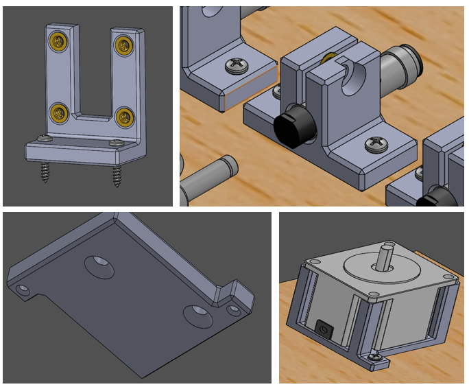
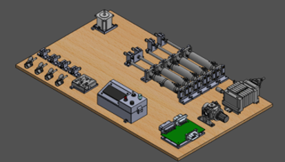
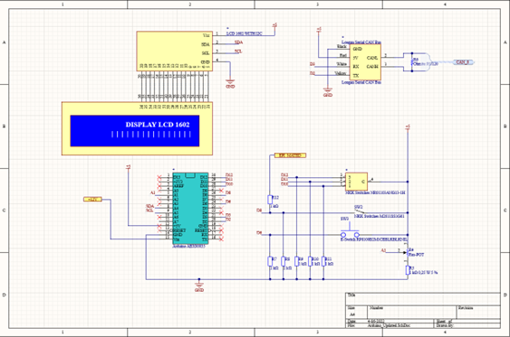
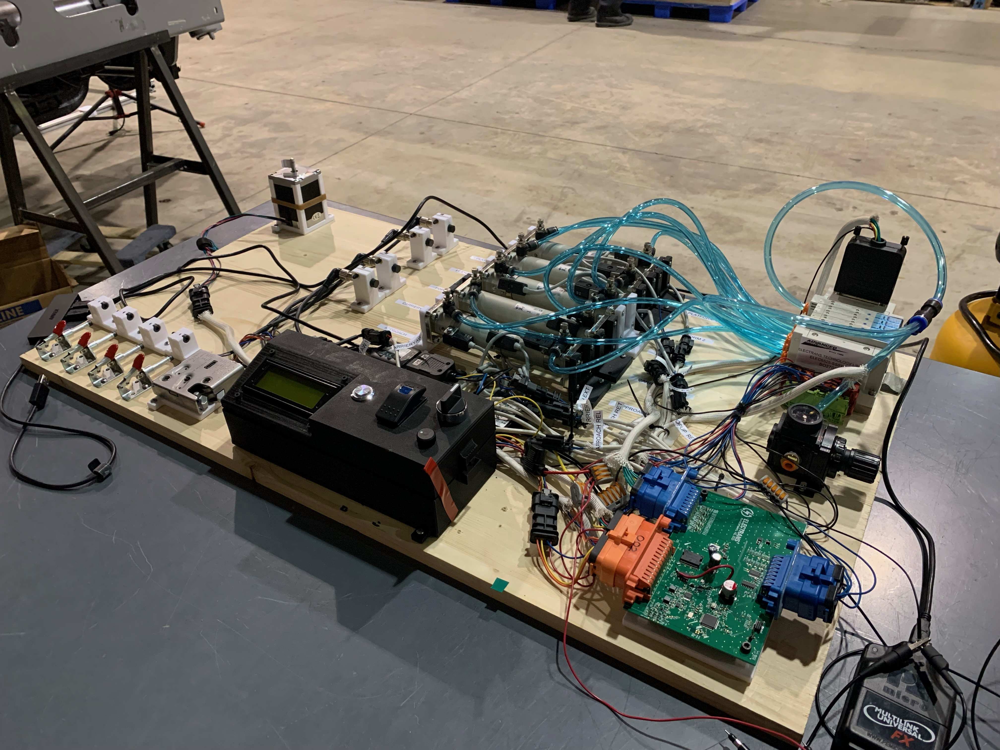

# Objective

The objective of this project was to design and build a Hardware Testing Fixture for the Printed Circuit Boards (PCBs) for a new Electronic Control Unit (ECU) that would be integrated into a heavy-duty vehicle's CAN bus. The exact details of the ECU are confidential to Electrans Technologies and therefore are not included in this report. The test fixture had the same mechanical actuating components and sensors as the final system to emulate their integration with the controller in an isolated environment.

# Background Information

The Controller Area Network (CAN) is a two-wire vehicle bus that is an international standard for the automotive industry known as ISO 11898. Compared to previous dedicated wire harnesses used in vehicles, the CAN bus is a high-integrity system that reduces wiring cost, complexity, and weight. Components connected through the CAN bus are referred to as nodes or electronic control units (ECUs). ECUs communicate by broadcasting information, such as sensor data, onto the CAN bus and all others ECU can check the data and decide whether to receive or ignore it”. Data broadcasted across the CAN bus are sent in packets called frames. A CAN frame consists of 8 parts, which in the adjacent figure.

Different vehicles and automotive companies may use different CAN communication protocols in their systems. This is because, while standard CAN is extremely effective in automotive and smaller embedded applications, it is not alone suitable for networks and messages with more than 8 bytes. The Society of Automotive Engineers (SAE) developed SAE J1939 which is a higher-layer protocol based on standard CAN communication. J1939 is an industry standard heavy-duty vehicles and off-highway machines such as construction, material handling, mass transportation, forestry machines, agricultural machinery, maritime and military applications. There are several key characteristics of the J1939 protocol. Most notably, J1939 extends the CAN identifier from 11-bits to 29-bits by adding an 18-bit unique frame identifier known as the Parameter Group Number (PGN). As an example, based on the SAE J1939-7 documentation, a J1939 message with a PGN of 61444 (HEX ID 0F004), represents the “Electronic Engine Controller 1 – EEC1”. Additionally, its signals sent in the data bytes are identified with Suspect Parameter Numbers (SPN). They can be described in terms of their bit start position, bit length, scale, offset and unit.

# Problem Definition

Electrans Technologies is in the process of the designing a new ECU for heavy-duty vehicles. Electrans has completed the 3D CAD model, design the central PCB, and programming its firmware. As Electrans transitions to full assembly of the ECU, it is imperative that the start-up properly tests the controller’s compatibility with the ECU’s hardware - sensors, pneumatics, motors. If not, Electrans risks the chance of damaging the assembly or missing key points of improvement. Additionally, by not testing their controller in parallel with the assembly of the ECU, Electrans will create a bottleneck in their design process. This is because certain changes to the controller could be realized now through testing while the ECU is being assembled rather waiting for assembly to finish and tsetings afterwards. Therefore, Electrans requires a test fixture to test the main controller with the mechanical components of the system before adding it to the final assembly.

## Requirements 

- The fixture shall have the same set of actuators and sensors as the new ECU to emulate their inputs and outputs with the controller board in the main assembly
- The fixture shall use an Arduino and physical switches to create CAN signals to mimic CAN communication with a heavy-duty vehicle.
- The fixture shall hold removable metal pieces to activate any pairs of proximity sensors together.
- The controller device(s) under test can be placed into or removed from the fixture any modifications to the hardware
- The fixture’s hardware shall have hard emergency e-stop

## Constraints

First, the test fixture must be easy to operate. Engineers will likely be making continuous changes to the controller during the design process and should be able to make those changes very easily.

Secondly, the design process of the test fixture must minimize costs. This will increase the profitability of the overall ECU project.

# Design

Based on HILSR-1, the Hardware-In-Loop (HIL) test fixture must have the same mechanical components as the final system. However, in the final system, there are two pairs of cylinders which are connected to the same air flow. Therefore, the test fixture will require two less cylinders than the ECU since only one cylinder is required per pair to demonstrate their behavior. Consequently, there will also be one less auto switch on the test fixture since it would be mounted on one of the paired cylinders in the final system.

The purpose of the test fixture is to analyze the operation controller with mechanical components in an isolated environment. Therefore, all of the components were mounted onto a horizontal, wooden board. This made it easy to see all of the components at once and mount them quickly using screws. This exlcudes the auoswtiches which were mounted to the pneuamtic cylinders to indicate the state of the cyclinder with an LED.

To secure the components in an optimal orientation – for instance the cylinders oriented horizontally and the stepper motor upwards – mounting brackets were designed and 3D printed for nearly all of the components. 

The only requirement for the location of the mechanical components on the test fixture was that the inductive proximity sensors must react to the cylinders and trigger a signal when they are fully extended. Therefore, the proximity sensors were placed opposite to the cylinders, 8mm from the fully extended position of the rod. This was based on the proximity sensors’ range specification so the sensor would only trigger when the cylinder was fully extended. The placement of the rest of the components was based on weight distribution and keeping the controller and Arduino along of the edges of the fixture. This would make it easier for the engineers to reach the two components.

# Electrical Design

An Arduino Nano was used as the main board for the selected swtiches. The test fixture’s Arduino program was separated into three main tasks: initializing and updating the switches, updating the LCD display, and sending CAN messages. Each switch had its own class, written in its own separate .cpp and header file.. Each switch class had both private and public members. The private members included the current state of the switch, the switch’s input pin on the Arduino, and, for the potentiometer, the interval of values to select from. The public members included the switch’s own initialization and update functions, which would be called from the main .ino file.

The LCD display was connected to the Arduino using Inter-Integrated Circuit (I2C) protocol. I2C is a short distance communication bus that only requires two signal wires to exchange information: Serial Data (SDA) and Serial Clock (SCL). This is much more efficient than connecting directly to the LCD display since that would require twelve signal wires. Based on the Arduino pinout, the SDA and SCL wires of the LCD were connected to pin 23 and 24 of the Arduino, respectively. In the firmware, the LCD was controlled using the Arduino library “LiquidCrystal_I2C” which was written by Frank de Brabander and is maintained by Marco Schwartz. In each of the switches update function, the LCD was updated to display the current state of the switch being updated. 

# Software 

There are four signals that the ECU will receive from the vehicle's CAN Bus: engine speed, current gear, start signal, and latch state. . For each signal, an appropriate switch was selected for the HIL Fixture. For the engine speed signal, a linear potentiometer was selected since it allows users to choose any value within a set interval based on the resistance of the switch. For the current gear signal, a 3-position rotary encoder was selected to choose between a parked, reverse, and forward state. For the start signal, a mom-off (momentarily on/off) push button was selected since the start signal only needed to be sent for a moment. Finally, for the state of the latch signal, a on-off toggle switch was selected since the latch only has two states: connected and disconnected. While the start signal and the latch state signal are specific to the ECU, the engine speed and current gear signals can be found in the SAE J1939-7 documentation.

To create and send CAN signals from the Arduino, a Serial CAN bus module was connected to the circuit. This module was able to turn the Arduino’s UART signals into CAN signals that were to be sent to the main controller board. Since the Arduino was focused on sending specific signals rather than an entire CAN frame, a custom function was created to properly place a switch’s CAN signal into a CAN frame without affecting the rest of the data of the frame:

As parameters, the function takes an uint8_t array with eight elements (each element represents a byte from the original CAN frame) that is passed by reference, the value of the signal, the start bit of the signal within the CAN frame, and the length of the signal. First, the array is read into a uint64_t variable with an 8-iteration for-loop that saves an element of the array into the uint64-t variable then shifts the bits of the variable to the left by 8 before repeating the process with the next element of the array. After the for-loop, a second uint64-t variable is created equal to the value of the signal that was passed as a parameter. This variable is then left shifted to the start position of the signal. Then, the original uint64_t variable is passed through an AND mask to clear the bits in the position signal, and then passed through an OR mask with the uint64_t variable equal to the value of the signal to successfully save the signal into the uint64_t variable without affecting any other bits. Finally, the uint64_t variable is saved into the array that was passed by reference with another 8-iteration for-loop and right shifting the bits.

The CAN signals from the Arduino circuit were monitored with a Vector CANalyzer tool to ensure that the Serial-to-CAN module and custom CAN message function was working as expected. Once all components, connections, and firmware had been tested on the breadboard, all components and wires were soldered to a protoboard and mounted to the test fixture.

# Final Design

To connect all of these components to the controller, a wire harness needed to be designed and assembled. When examining each of the component's signal wires, the auto switches had the smallest wire gauge of 24 AWG, while the rest of the components had a 22 AWG wire gauge. Therefore, I selected the MCON 1.2 series connector for the wire harness since they are compatible with 24-16 AWG wire and extremely durable and safe with an IP of 6K9K. Additionally, the MCON connectors range from 2 to 6 position connectors, therefore a connector is available for all components except the pneumatic manifold. The pneumatic manifold uses a 25-pin D-Sub connector which was also sourced externally.

The completed HIL fixture is used only internally at Electrans for engineers to test their controllers for the current design of the final system Any new iterations to the controller or final ECU product will need to be reflected in the HIL fixture. This could be adding or removing a component or changing connectors to the controller. Therefore, the test fixture will likely require consistent updates to remain up to date and effectively test the controller before it is placed into the vehicle.

