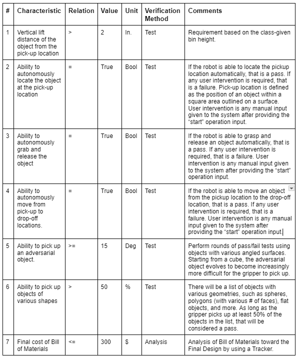
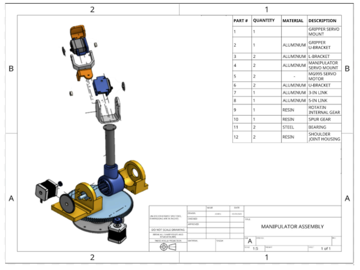
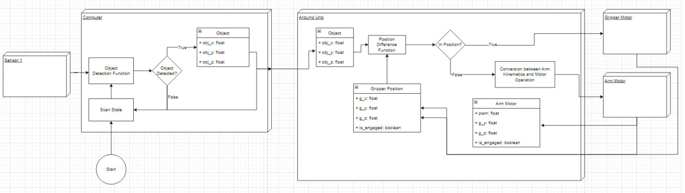
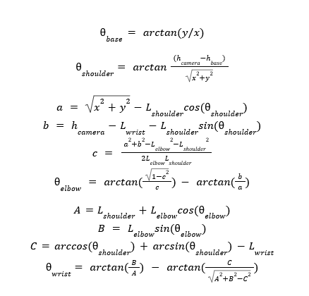
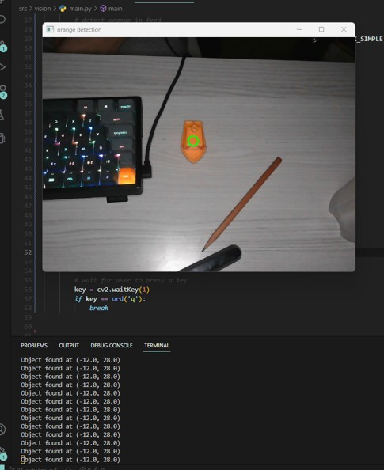

# Overview

My favourite course during my 3rd year at the University of Waterloo was definitely ME380 – Mechanical Engineering Design Workshop. The course was based on a term project where each group of students had to design and build a pick-and-place manipulator following specific constraints and requirements. I really enjoyed how this course pushed groups through each phase of the engineering design process and included the construction of a working prototype. It was also really interesting to see the different groups’ final manipulators and showcasing how group successfully tackled the constraints and requirements in a different manner.

Our team chose to design a manipulator that was also autonomous and capable of dealing objects with complex geometries. This meant the manipulator needed to detect objects, calculate required movements, and handle objects ofvarious shapes and sizes, specifically those that are difficult to grasp. For the project, I was mainly focused on the electric and firmware aspects of the manipulator, including computer vision and motor control. However, everyone on the team wore many hats and was involved in all major design decisions.

## Learnings

# Needs Analysis

A need exists for a manipulator to lift and move a complex geometry object from a specified pick-up location to a specified drop-off zone autonomously without user intervention. The system must also feature the capability to handle adversarial objects. 

## Design Specification

The design constraints and criteria related to the course requirements and our team’s own desire for autonomous and adversarial grasps is shown in the table below.

# Design Process

## Gripper Design

We explored three initial concepts for the gripper, with the focus on being able to pick up challenging and adversarial objects. Each of the designed grippers were to be powered by a micro-servo motor which was mounted into a rack-and-pinion system to translate a cylindrical rod that would open and close the gripper’s prongs through attached levers. All components of the gripper were 3D-printed except for the rack which was aluminum-based, the servo motor, and the bolts to mount the servo motor, this was to reduce the final moment arm of the gripper on the base of the manipulator for easier operation.

The final design was a three-pronged gripper with an angled fin edge. This was chosen for its adaptability to various object geometries, as the fins would increase the contact area with the object and ensure grip by scooping the objects. The fins also acted as a cage which prevented the object from falling out of grip during operation of the manipulator – a common issue with the other designs.

## Manipulator Design

Similarly, three designs were considered for the manipulator. This included a 4-DOF articulated arm, a crane-pulley system, and a 3D prismatic manipulator. Ultimately, the 4-DOF arm was chosen for its ability to lift objects to a higher height at a lower material cost. The arm was powered by two servo motors as the elbow and wrist joint, and two stepper motors at the shoulder and base rotation joint, as shown below. This is because we found from testing that the base and shoulder joints required a larger torque that was beyond the servo motors, therefore steppers were used. This arm was integrated with the three-pronged gripper and controlled by an Arduino microcontroller. The design of the arm focused on achieving precise and smooth movements while maintaining stability by not overextending the arm and created too much of a moment on the base. The use of stepper motors allowed for accurate positioning, which was essential since we were pursuing autonomous operation.

## Controls

Based on the design of the manipulator and gripper, the project requires 2 stepper motors and 3 servo motors. The electrical and software design was then based on controlling these components to achieve the desired engineering specifications. The motors would be controlled by either a microcontroller such as an Arduino or computer such as a RaspberryPi. A Raspberry Pi would have been ideal as its increased computing power could be used for the computer vision aspect of the project.

However, Raspberry Pi’s were quite expensive at the time, so an Arduino was selected to be paired with a laptop to process the computer vision. A 5V 10A power supply was sourced and set as the foundation to source our motors upon. The provided servo motors from the University of Waterloo, the T9005 motors, were used since they met the required ratings to operate with the power supply. For stepper motors, two NEMA 17 motors were sourced from the University of Waterloo.

A breadboard with MOM/OFF switches was attached to the Arduino to test each of the motors in the circuit. The circuit and motors were tested by confirming that you could turn each of them their full range of motion - 180 degrees for the servo motors, and indefinitely for stepper motors - in both directions after one another. This round of testing was successful in the first attempt in terms of the electrical circuit; however, it yielded important design decisions in terms of initializing the motors in Arduino’s software. 

For the servo motors, the testing demonstrated that while each can travel 180 degrees, the software value for 0 and 180 degrees is different for each servo motor. The Adafruit Servo Shield Library recommended a minimum and maximum range of 100 and 500, respectively. Therefore, to find the actual range the range was increased by 5-10 on both ends until the servo motors were able to travel a range of 180 degrees. The final range for each of the servo motors is shown below in Table 3.

### Object Detection

In terms of object detection, the main design decisions were which sensors would be used and what corresponding software would be used to consistently detect the desired object. The main options for sensors were one overhead camera, two or more cameras set up around the manipulator, or ultrasonic sensors set up around the manipulator. As shown below, in Table 6, one overhead camera was selected due to its lower cost and complexity.

## Software 

This flow was modeled based on the functional requirements where the functional requirement is an action/event in the software. Additionally, the flow is a closed loop that returns to its home position to match Arduino’s main loop() function properties.

## Object Detection

When researching potential object detection protocol for the manipulator, it was determined that it would be too computationally intensive for the Arduino to perform all of the tasks. Therefore, the object detection protocol and conversion to motor positions would be completed on an external sensor and computer, with the final position for each of the motors being sent to the Arduino to control the motors. The general flow chart was updated to match this architecture and is shown below in Figure 8.

These coordinates would then be used to determine the angle of each joint of the manipulator, and therefore the position of all of the motors. The camera would be placed behind the manipulator’s base making the manipulator approximately the (0,0) coordinate. The general kinematics equation to solve for joint angles is shown below in equations 1-4 [2].

The software object detection algorithm that is the simplest to pair with the single overhead webcam while still providing accurate results is based on HSV contrast. The program would loop through the camera’s frames, moving noise can change the format from RGB to HSV. Afterwards, a mask of the desired colour in HSV is applied to the frame and the largest area is contoured. Finally, this contour is used to determine the center coordinates of the object. 

# Conclusion

This final design was able to successfully satisfy all of the engineering design specifications listed in Table 1. With the use of a camera on a camera stand, the object detection is able to locate and record the benchy’s position and send these coordinates to the computer.  The design also demonstrates the ability to autonomously pick up and drop off target objects once its coordinates have been detected. This was demonstrated through hard-coding the robot to move to a pre-established pick-up location, grab the object, move the object to the required drop-off zone, and consequently release the object. Also, the manipulator and gripper can be manually controlled using the computer keyboard key for instances where the object has not been placed in a pre-set location.  This mode can be used to highlight the robot’s ability to reach objects further away and alternate between scooping and gripping pick-up methods. Full testing and results of this product can be found in the subsequent section.
