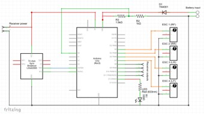
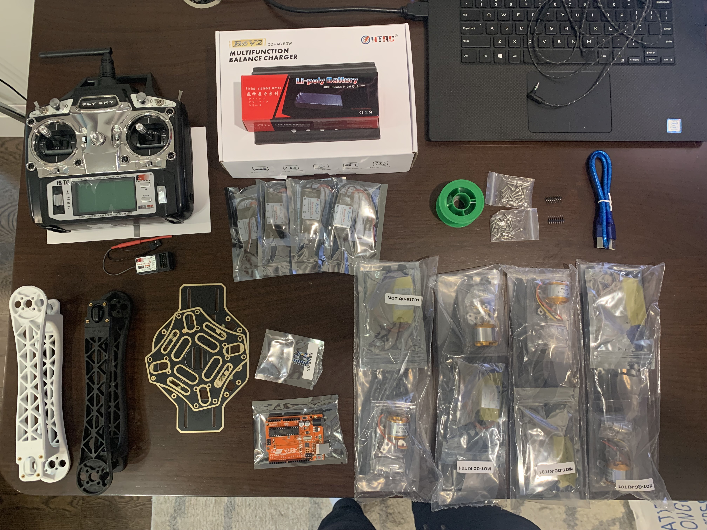
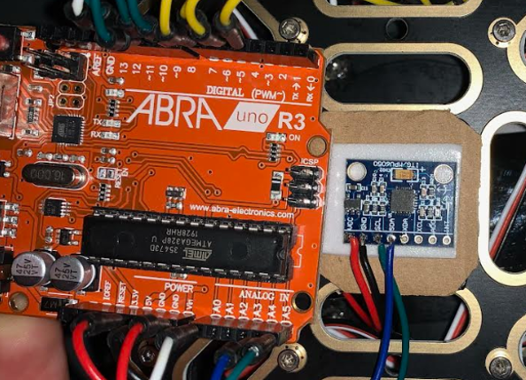
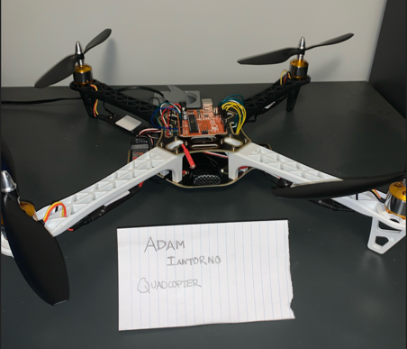

# Overview

As I was exposed to new aspects of engineering from my co-ops, I realized that I was very unfamiliar with electronics, firmware, and printed circuit boards (PCBs). Since I would not get much exposure to these concepts during my mechanical engineering degree, I decided to build an arduino-powered quadcopter. I completed this project during the 2020 summer and fall term.

As a starting point, I found an electrical schematic for an arduino-powered quadcopter online, shown to the right, and based my project on it. I wanted to avoid pre-built drone kits during so that I could really learn the engineering concepts and experience sourcing components for a project as if I was at a start-up or company.

*Quadcopter reference electrical schematic*

I sourced all the components from various suppliers such as Amazon, Abra Electronics, and Digikey. Since I was sourcing components individually and not buying a whole kit, it was imperative that I ensure all of the components would connect properly. A table and picture of all of the components are shown below. I also purchased a soldering kit, variety resistor pack, and male-to-male breadboard jumper cables.

*Quadcopter components*

## Assembly

soldering

Once the bottom frame was assemebled, I switched my foucs to connecting the arduino and gyro to the assembly. Following the aforementioned schematic, I first soldered my wires to the gyroscope. I connected the I2C SDA & SCL wires to the corresponding ports on the Arduino Uno, and the ground and power to the bottom frame of the quadcopter. I connected two resistors (1.5k and 1k) in series and used them between the connection with the battery and arduino's VIN port. When connecting the arduino to the ESCs the specific pins used were noted from programming the controls in the next step. The remainng wires were integrated following the schematic. Finally, the transmitter was mounted to the lower frame using double sided tape.

*Connection between Arduino and Gyro*

## Software

Once assembly was finished, the next step was setting up the software and controls of the quadcopter. The biggest hurdle for me during this process was understanding Pin change interrupts. Pin change interrupts interrupt a running program when the state of a digital pin chagnes. For the Arduino Uno the pin change interrupt will trigger if the D8, D9, D10, D11, D12 pins were toggled. Therefore, the receiver inputs for the transmitter were connected to pins D8-D11. In terms of software, this meant enabling the pin change interrupt by setting the PCIE0 bit to one, and enabling each digital pin individually by the PCMSK0 register. Once the interrupts were enabled, I researched and figured out that I needed to develop an interupt routine that would execute everytime one of the receiver pins changed states. This subroutine would check if each input switched on/off; remember the state; and adjust that pins timer accordingly. I forked a software library online that would use these input states to determine the yaw, roll and pitch of the quadcopter based on these inputs and set the ESC's accordingly.

The final step of the quadcopter proejct was integrating the gyro into the system. I was using the L3G4200D gyro; based on its documentation, I found that its output was an angular rate sensor. The registers that i used in this project were CTRL_REG1, CTRL_REG4, and the outputs for the x, y, and z axis. I needed to set the BDU bit of CTRL_REG4 since the angular rate data is sent through two bytes, and we need to be sure both bytes are from the same semple time. During operation, the arduino is reading angualr rate data from the register addresses of the x, y, and z registers. Since I would be requesting 6 bytes of data (2 for each axis), I programmed the Arduino to wait until all 6 bytes have been received before reading its values.

The final task of the quadcopter project was calibrating the ESC's for flight. The ESCS are controlled with a 1000us till 2000us pulse - 1000 being off, and 2000 being full throttle. Knowing this, the main software loop became:

    Read the gyro angular rate data
    Calculate the PID corrections
    Calculate the puls for every sec
    Compensate every pulse for voltage drop
    Send the Calculated pulses (1000-2000) to the ESCs

# Summary

In summary, this project was a great learning experience that allowed be to better understand electronics and firmware. I was actually surpised how much I learned in terms of programming PCB registers and motor controls. This project was very helpful when I was working on the Hardware-In-Loop test fixture during my co-op at Electrans.

